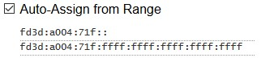

# Networking

[ZeroTier] is a great product. It provides a Layer 2 P2P Switch, which means that Bonjour and any other local anycast communication strategy should work without using a any router and propagation between network ranges.

It is an impressively low-lantecy option. I can't recomend them enough.

My idea is to use ZeroTier as a virtual network, making all devices communicate with each other.
Taking advantage of ther [6PLANE] IPv6 addressing scheme, I would also be able to make Docker containers on any host be able to talk to each other, without using a Network plugin.

TODO: Bootstrap a Nomad cluster with 6PLANE communication (alternative to Flannel and other VXLAN).
TODO: Document VPN setup using [algo] (WireGuard + IPSEC)

## ZeroTier Setup

### IPv4

This setup will route from `10.147.16.0` to `10.147.17.255`. Zerotier will have `10.147.17.0` to `10.147.17.255` to autoassign among it's devices.
The beggining of the range will be reserved to use on on the phyisical router side.

Using a `/23` netmask instead of a `/24` allow us to configure our router to use a Layer 2 Bridge, and propagate packates from ZeroTier into their LAN.
This mean that any device on the physical side of the router will be visible to the virtual network, and any node on the virtual will be visible on the physical side as well.

If you need, you may increase the netmask. Just search for any netmask calculator online, and adjust what is allowed to be routed on the ZeroTier network.

For this bridge to work, delete everything on **Managed Routes** and add `10.147.16.0/23` to have ZeroTier also acknoledge what the travel router will bridge.
Leave the second box empty to route to `(lan)`.

### IPv6

We will provide 3 different IPv6 IPs per device conneccted on ZeroTier network:

- **RFC4193**: `/128` to connect directly to the device using IPv6, giving each connected device a single IP
- **6PLANE**: `/80` o allow Docker daemon to expose each container on the network by providing each with an IP
- **Auto-Assign Range**: Using a `/48` range with **ULA addresses**, to allow manual configuration of the Bridge on the router side

[ULA] addresses are similar to a private network range of IPv4.
The suggestion is that each [ULA] range should be selected using MAC address and time, and there [are tools](https://www.ultratools.com/tools/rangeGenerator) to you create yours.

With ULA configured, you will be able to give the physical router its own `/48` range,
and it will forward the prefixes, so the physical devices also have a `/80` for their containers and a `/128` for themselves.

Summing everything up, it will endup like this:

## Travel Router Setup

TODO: Document OpenWRT setup

## TODO: VLAN and better isolation

[ZeroTier]: https://zerotier.com/
[6PLANE]: https://zerotier.atlassian.net/wiki/spaces/SD/pages/7274520/Using+NDP+Emulated+6PLANE+Addressing+With+Docker
[ULA]: https://en.wikipedia.org/wiki/Unique_local_address
[algo]: https://github.com/trailofbits/algo